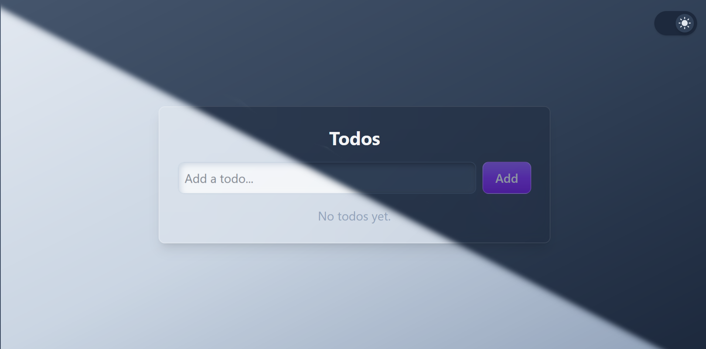

# 🚀🔥 MERN Todo List 🚀🔥



A full-stack **Todo List** app built with the modern MERN stack, styled with **Tailwind CSS**, powered by **Vite**, and tested with **Jest** and **Supertest**.  
Includes **MongoDB** integration via **Docker** for easy local development and **GitHub Actions** for CI.

---

## 💡 Features

- **Custom CSS design by me, featuring glassmorphism elements**
- Add, edit, delete, and toggle todos
- Responsive UI with dark mode
- Optimistic UI updates
- Modal dialogs for editing and deleting
- Full CRUD API with validation
- Easy local MongoDB setup (no cloud account needed)
- Automated code formatting and linting
- Full test coverage for backend API


---

## 🛠️ Technologies Used

- **Frontend**
  - [React](https://react.dev/) (with hooks and context)
  - [Vite](https://vitejs.dev/) (fast dev/build tool)
  - [Tailwind CSS](https://tailwindcss.com/) (utility-first styling)
  - [Axios](https://axios-http.com/) (HTTP client)
  - [ESLint](https://eslint.org/) (linting)
  - [Prettier](https://prettier.io/) + [prettier-plugin-tailwindcss](https://github.com/tailwindlabs/prettier-plugin-tailwindcss) (code formatting)

- **Backend**
  - [Express](https://expressjs.com/) (REST API)
  - [Mongoose](https://mongoosejs.com/) (MongoDB ODM)
  - [MongoDB](https://www.mongodb.com/) (database)
  - [Docker](https://www.docker.com/) (local MongoDB container)
  - [Jest](https://jestjs.io/) (testing)
  - [Supertest](https://github.com/visionmedia/supertest) (API testing)
  - [Nodemon](https://nodemon.io/) (dev server)

- **DevOps**
  - [GitHub Actions](https://github.com/features/actions) (CI/CD)
  - [Docker Compose](https://docs.docker.com/compose/) (service orchestration)
  - [Concurrently](https://www.npmjs.com/package/concurrently) (run frontend & backend together)

---

## ⚡ Quick Start

### 1. **Clone the repo**

```sh
git clone https://github.com/ViniMarfil/Todo-mern-list.git
cd todo-mern-list
```

### 2. **Start MongoDB with Docker**

```sh
docker-compose up -d
```

### 3. **Install dependencies**

```sh
npm install
```

### 4. **Run the app (frontend & backend)**

```sh
npm run dev
```

- Frontend: [http://localhost:5173](http://localhost:5173)
- Backend: [http://localhost:3001](http://localhost:3001)

> **Note:** Make sure [Docker](https://docs.docker.com/get-docker/) is installed to run MongoDB locally.

---

## 🧪 Running Tests

```sh
cd backend
npm test
```

---

## 💪 Continuous Integration

- Automated tests run on every push and PR via **GitHub Actions**.
- MongoDB is spun up in CI using Docker.

---

## 📝 Project Structure 

```
├── backend/      # Express API & MongoDB models
├── frontend/     # React app
├── docker-compose.yml
├── .github/workflows/ci.yml
├── .prettierrc.json
├── .gitignore
└── package.json
```

---

## 📄 License

MIT

---

**Made by ViniMarfil**
